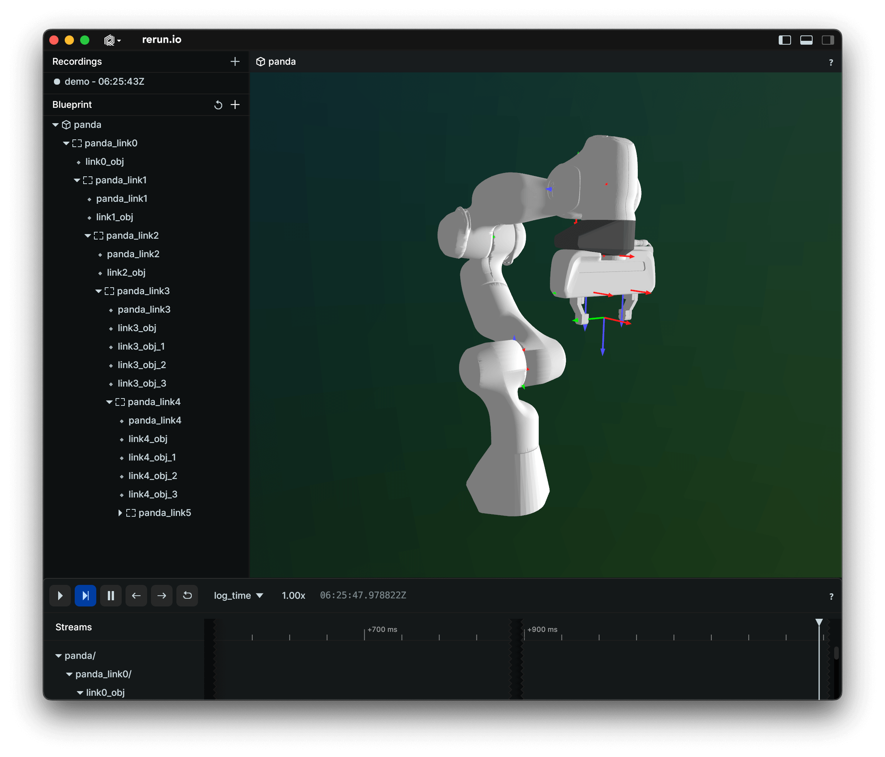

# rerun-robotics

Utilities to use the amazing [Rerun visualizer](https://www.rerun.io/) for robotics applications.
This repo is a work in progress.

## Installation

```bash
pip install rerun-robotics
```

### Install from source

```bash
git clone https://github.com/williamshen-nz/rerun-robotics.git
cd rerun-robotics
pip install -e .
```

## Usage
Check the [Rerun documentation](https://www.rerun.io/docs) for information on how to use the viewer.

We currently support the Franka Emika Panda robot and setting it via joint positions.

```python
import rerun as rr
from rerun_robotics import load_franka_panda

rr.init("demo", spawn=True)

panda = load_franka_panda()
# 7 arm joints + 1 gripper joint
panda.set_joint_positions([0, -0.75, 0, -2.35, 0, 1.57, 0.78, 0.04])
```



### Franka Panda Demo

```bash
python -m rerun_robotics.examples.panda
```

[Source code](rerun_robotics/examples/panda.py)
